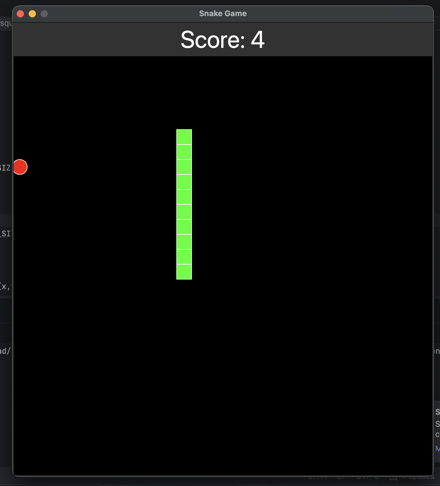

# Snake-Game-Python


A classic Snake game made with Python and Tkinter.

## Features
- Snake movement
- Food spawning
- Score system
- Collision detection
- Screen wrapping

## Technologies
- Python
- Tkinter

## How to Run

```bash
python main.py
